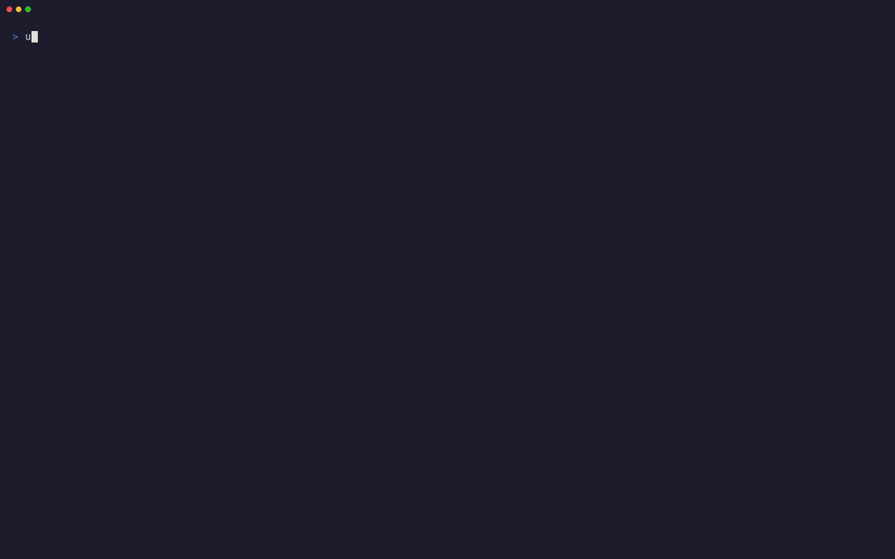

# Chess Analyzer TUI

Interactive terminal chess analysis from FEN or PGN text, files, or your clipboard, with Stockfish as the default engine and support for other UCI engines.

Piece rendering adapted from [Thomas Mauran's chess-tui](https://github.com/thomas-mauran/chess-tui).
Full renderer credits and license information are below.



## Install and run

Requires Python 3.11+.

Once published on PyPI, install the `chess-analyzer-tui` package with either tool
manager. Both install the `chess-analyzer` command (the command name is not a
separate PyPI package):

```sh
uv tool install chess-analyzer-tui   # or: pipx install chess-analyzer-tui
chess-analyzer # opens a new game
chess-analyzer "1. e4 e5 2. Nf3 Nc6 *"
chess-analyzer https://lichess.org/nrmBGiQF
chess-analyzer https://lichess.org/study/r072zv4F/R33cxdop
chess-analyzer https://www.chess.com/game/live/4912555148
chess-analyzer --file game.pgn
chess-analyzer --file position.fen
chess-analyzer --clip
chess-analyzer --continue          # or: chess-analyzer -c
chess-analyzer --white "Supi" --black "Carlsen" "2kr2nr/1pp2ppp/3b4/1P3q2/2Pp1B2/5Q1P/RP3PP1/R5K1 w - - 0 1"
```

The command works from any directory. If it isn't on PATH, use
`uv tool update-shell` (or `pipx ensurepath`) and restart your shell.

Pass quoted FEN or PGN text, a Chess.com game URL, a Lichess game or study URL, or
an HTTPS URL that serves plain-text PGN. The examples include a Lichess study of
Mikhail Tal and a regular Lichess game by Magnus Carlsen, plus a public Chess.com
game by GM LPSupi. Use `--file`
to read a UTF-8 file or `--clip` to read the clipboard. Choose one input source;
the format is detected automatically. URL loads
are limited to public HTTPS hosts, 4 MiB, and a 10-second request timeout. Without
input, analysis starts from the initial position.

Options:

- `--file PATH` — load FEN or PGN from a file
- `--clip` — load FEN or PGN from the clipboard
- `--continue` / `-c` — restore the last analysis session
- `--ascii` — use ASCII pieces
- `--time 0.5` — set analysis time
- `--lines 3` — show multiple lines
- `--threads 2` — set engine threads, if supported
- `--hash 256` — set engine hash size, if supported
- `--engine /path/to/engine` — choose a UCI engine executable
- `--white "Supi"` / `--black "Carlsen"` — label the players (override PGN names)

Copy a FEN position or PGN game and run `chess-analyzer --clip`.
On Linux, install `wl-clipboard` for Wayland, or `xclip` / `xsel` for X11;
a graphical session is required. macOS and Windows use their built-in clipboard
support.

## Continue an analysis

Run `chess-analyzer --continue` (or `-c`) to restore the last game, explored
branches, imported PGN comments and side variations, current position, player names,
and board orientation. Engine analysis
is recalculated using the current command-line settings.

The session saves automatically as you navigate or flip the board. Starting a
new analysis replaces the previous session. One small `session.json` file is
stored locally:

- Linux: `$XDG_STATE_HOME/chess-analyzer`, or `~/.local/state/chess-analyzer`
- macOS: `~/Library/Application Support/chess-analyzer`
- Windows: `%LOCALAPPDATA%\\chess-analyzer`

`--continue` cannot be combined with text, `--file`, or `--clip`.

## Stockfish

Stockfish is the default engine and is installed separately. If it isn't found,
the app detects your OS (and Linux distribution) and suggests an installation command:

| Platform | Command |
| --- | --- |
| Debian/Ubuntu and derivatives (e.g. Linux Mint) | `sudo apt install stockfish` |
| Arch and derivatives (e.g. Manjaro) | `sudo pacman -S stockfish` |
| Fedora | `sudo dnf install stockfish` |
| macOS (Homebrew) | `brew install stockfish` |
| Windows (WinGet) | `winget install --id Stockfish.Stockfish --exact` |

Other distros/platforms get the [official download link](https://stockfishchess.org/download/).

After installation, make sure `stockfish` (`stockfish.exe` on Windows) is on
PATH: add the executable’s directory to PATH and restart your shell if needed.
Alternatively, pass an executable with `chess-analyzer --engine /path/to/stockfish`
(on Windows: `chess-analyzer --engine "C:\path\to\stockfish.exe"`).

Stockfish is found on PATH or beside the application module as `stockfish`
(`stockfish.exe` on Windows). Other UCI engines can be selected with
`--engine /path/to/engine`—for example, Leela Chess Zero (Lc0) with
`--engine /path/to/lc0`. Configure engine-specific files and settings, such as
Lc0's network weights and backend, separately. The app applies thread, hash,
and multiple-line settings only when the engine supports them.

## Navigation

PGNs open at the final position and use their `White`/`Black` headers for player labels
when present. Use `--white` and `--black` to set or override names, including for FENs.
PGN comments (including Lichess study annotations) appear at their own positions.
Imported side variations are listed alongside engine moves; follow them with the
same keys or mouse clicks. Comments stay attached to that game's move tree, not
other games or engine-generated positions.

- **↑/↓** — choose an original move or engine alternative
- **→/Enter** — follow the selected move; **←** — step back
- **Esc** — return from an explored line to its game position
- **f** — flip board; **r** — reanalyze; **q** — quit

Moves, the return link, and any original-game move (or Start) are clickable.
Branches are retained, and navigation never waits for analysis.

Use at least 40×24 terminal cells. Larger boards use multiline pieces; smaller
ones use chess glyphs. Narrow layouts stack the panels; scroll with the mouse
wheel or Page Up/Down. Blue highlights the selected move, yellow the previous
move, and red a checked king.

## Renderer credits

The piece artwork and size-adaptive rendering approach are adapted from
[Thomas Mauran's chess-tui](https://github.com/thomas-mauran/chess-tui), using its
[piece designs](https://github.com/thomas-mauran/chess-tui/tree/fc1d4841532bf72f5a25c5cb45abe82ec25e056b/src/pieces).
The artwork is used under the MIT License; the full notice is preserved in
[licenses/chess-tui-MIT.txt](licenses/chess-tui-MIT.txt). The rest of this project
is released under [MIT](LICENSE).

## Verify

With Stockfish installed: `uv run python -m unittest discover -s tests -v`.
